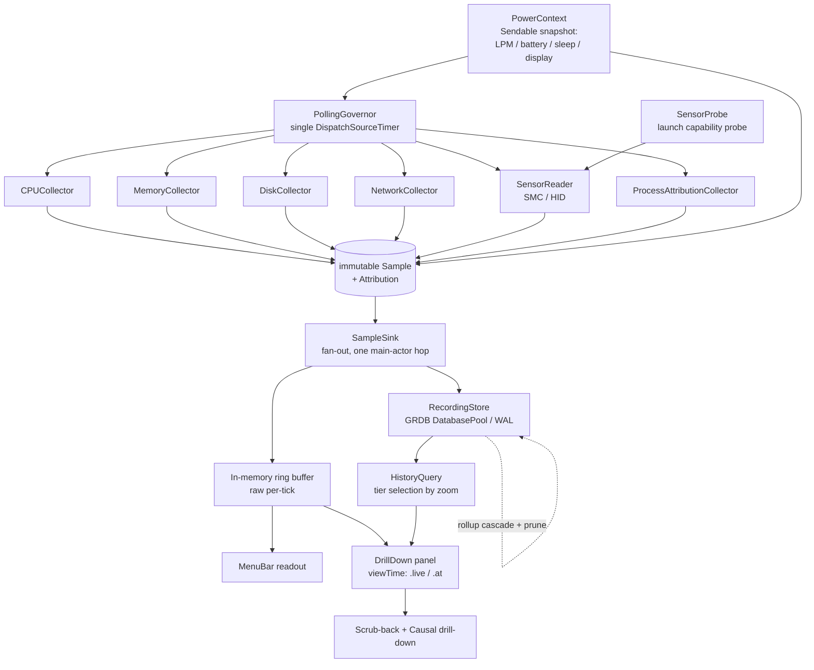
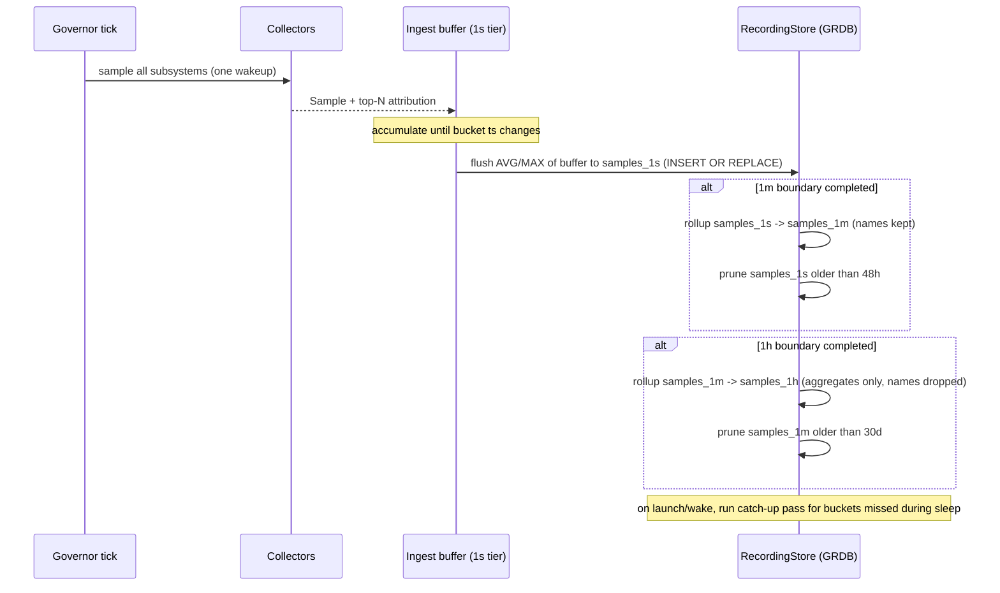
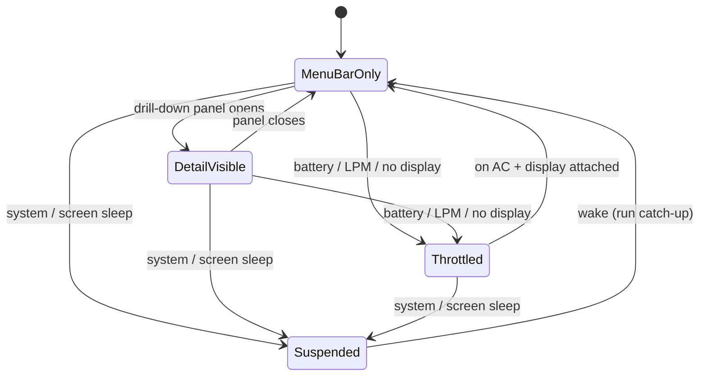

# feat: macOS Menu-Bar System Monitor (Momo)

## Summary

Build **Momo**, a self-run macOS menu-bar system monitor that reads CPU, memory, disk, network, temperatures, and fan speeds in-process with no privileged helper, and records every metric continuously — with per-process attribution — into a persistent tiered-rollup store from first launch. Delivery is phased: **Phase 1** ships the collectors, the live menu-bar/drill-down UI, and the recording store running silently underneath (enough to retire iStat); **Phase 2** layers the flight-recorder scrub-back and per-subsystem causal drill-down on top of data already being captured.

---

## Problem Frame

The author runs iStat Menus but wants to own the tool. The genuinely useful question about a Mac is almost always retrospective — "what pegged my CPU at 3am?" — and no incumbent answers it well after a restart (Stats keeps only in-session ring buffers; iStat's history is thin), nor explains *why* a metric spiked without a trip to Activity Monitor. Momo's reason to exist is the time-series and data-visualization work: continuous recording, tiered rollups, scrub-back playback, and causal attribution. The daily-driver bar keeps it honest; the flight recorder is what makes it worth building (see origin: `docs/brainstorms/2026-06-19-macos-system-monitor-requirements.md`).

The store schema is the one irreversible decision — per-process attribution can never be backfilled, so it must be right before any data is written, even though the history *UI* lands in Phase 2.

---

## Key Technical Decisions

- KTD1. **In-process, no privileged helper.** Every metric — including temps and fans — reads without elevated privileges via in-process public C APIs and read-only private sensor APIs. This avoids the privileged LaunchDaemon / XPC / `SMAppService` install-and-trust dance, the most fragile, OS-version-coupled part of the space (see origin Key Decisions). The whole product is one well-behaved menu-bar app.

- KTD2. **Recording store = GRDB (SQLite) `DatabasePool` in WAL mode, append + rollup-job tiered tables.** Research ranked direct-SQLite (GRDB) above Core Data and SwiftData for a continuously-writing time-series store; GRDB gives a serialized writer + concurrent reader pool (UI reads never block ingest), `DatabaseMigrator` for schema evolution, and `ValueObservation` for history-view updates. Tier tables follow the MacSlowCooker model: one physical table per resolution, `ts` primary key, `INSERT OR REPLACE` for idempotent in-progress-bucket flush, `DELETE`-based prune for round-robin size bounding. Resolves the origin's "store technology" deferred-to-planning question. Three store-wide invariants are pinned here because they are irreversible or correctness-critical:
  - **Time base:** `ts` is **UTC epoch seconds** (never local time); all bucketing and retention math is UTC, and timezone is a display-only concern in the history/scrub UI. This prevents DST/timezone bucket-boundary corruption.
  - **Writer + transaction atomicity:** all ingest flushes and all rollup-plus-prune cascades execute on the single `DatabasePool` write serializer; reads use the reader pool. Each rollup level — read finer tier → write coarser bucket → prune the consumed finer rows — is **one write transaction** (all-or-nothing), and a finer-tier row is pruned only after the coarser bucket that consumes it is durably committed.
  - **Durability bound:** at most one in-progress finest-tier bucket may be lost on abnormal termination (SIGKILL / panic / power loss) — `applicationWillTerminate` flush covers only graceful exit. This is accepted because the finest tier is 1s/48h and the loss is < 1 bucket.

- KTD3. **Single central polling governor on one `DispatchSourceTimer`.** One second-aligned timer with ≥10% leeway, handler on `.utility`/`.background` QoS, feeds all subsystems on the same coalesced wakeup; the UI publish is the only main-thread hop. Rationale: macOS Energy Impact is dominated by timer *wakeups*, not CPU, and background QoS earns a ~0.52 impact multiplier — so the cheapest design is one coalesced wakeup, not N independent `Timer`s. Detail-tier collection is *paused* (not merely slowed) when no drill-down panel is visible, mirroring Stats' popup-gated readers. Resolves the origin's menu-bar/cadence concerns for R10/R11.
  - **Cadence conflict policy (defended):** when contexts conflict, **`DetailVisible` raises cadence for the visible metric(s) even under battery / Low Power Mode throttle** — an open panel is an explicit investigation request, and AE3 specifies that opening a drill-down increases cadence for the visible metrics. Non-visible collection stays throttled. **`Suspended` (system / screen sleep) always wins** — nothing is sampled while asleep. So precedence is Suspended > DetailVisible (for visible metrics) > Throttled > MenuBarOnly.
  - **Reconciling one timer with mixed cadence:** the single coalesced wakeup runs at the *fastest currently-required* interval and non-visible collectors are **tick-gated** (they skip wakeups to hit their slower effective rate). This means battery + panel-open *does* raise the wakeup rate while the panel is open — a deliberate, **bounded, user-present** exception to the idle-wakeup target (the user is actively investigating, not idle). The continuous-idle guarantee in R11 applies to the menu-bar-only state, not to an open investigation panel. U5's energy verification must therefore measure **both** the battery menu-bar-only case (≤1 wakeup/sec) **and** the battery panel-open case (bounded, returns to ≤1/sec on close).

- KTD4. **Tiered retention with per-process name-aging.** Three tiers: 1s full-resolution for 48h, 1m rollup for 30d, 1h rollup for ~2y. Per-process attribution (pid + name) **and the correlated foreground-app name** are kept at the 1s and 1m tiers and **dropped at the 1h tier** (the 1h tier keeps only scalar aggregates) — this bounds disk to the ~1–5 MB/month class and makes long-term process *and* app-usage history private-by-aging. The foreground-app field is the same privacy class as process names (a behavioral activity timeline), so it ages out on the same rule rather than persisting for the full 2y. Each scalar rollup bucket stores **MAX alongside AVG** for spiky metrics so the 1h tier doesn't hide the throttling spikes a monitor exists to surface. (User decision, this session.)

- KTD4a. **Per-process rollup aggregation contract.** Aggregating per-tick top-N into per-bucket attribution is non-trivial and is pinned here so it isn't invented at implementation time and silently bias every historical "what pegged my CPU" answer. One element is genuinely **irreversible** (it cannot be added for already-recorded data once raw ticks are pruned); the rest are **default policies, revisable by schema migration** but should be decided up front:
  - **Per-process columns (irreversible):** `proc_*` rows carry both an averaged `value` **and** a `value_max` (per-process peak). The `value_max` column's *existence* is the irreversible decision — without it the 1m tier hides exactly the spikes AE2 exists to surface, and it cannot be backfilled.
  - **Denominator (policy):** a process's per-bucket average is computed over the **full bucket tick count** (ticks where it was absent from the per-tick top-N count as 0), so a brief spike does not inflate `value`. Because this dilutes a short spike's `value`, spike-oriented reads must use `value_max`, not `value` (see survivor rule and U11).
  - **Top-N survivor rule (policy):** ranking survivors by peak alone would drop a process that held a steady 70% all minute in favor of one that spiked for a single tick — inverting the culprit for *sustained* load. So survivors are the **union of top-N by `value_max` (catches spikes) and top-N by `value` (catches sustained load)**, deduped and bounded to ~2N. Ties broken by `value_max`.
  - **CulpritView ranking (policy):** historical per-process ranking (U11) is by `value_max` when the user selects a spike on the MAX series, and by `value` for sustained-window questions — matching the series the user clicked, so the named culprit always matches the visible signal.
  - **PID reuse (policy):** a `(pid, name)` change within one bucket is recorded as **two distinct rows**, never summed — the OS reuses pids and merging would attribute one process's load to another.
  - The 1s→1m cascade aggregates over already-filtered `proc_1s` survivors (a process that never made any per-tick top-N is invisible at 1m by construction); this is intended.

- KTD4b. **On-disk privacy is enforced, not just logical.** Process **leaf executable name only** is persisted (`SomeApp`), never the full `proc_pidpath` (which would leak the home-directory layout and installed-software profile for up to 30 days); full path is resolved live-only and never stored. The store lives in the app's `Application Support` directory with **`0o600` permissions on the DB, `-wal`, and `-shm` files** (owner-only — SQLite defaults to `0644`, leaving a 30-day behavioral log world-readable on the account), is **excluded from Time Machine / iCloud backups** (`isExcludedFromBackup`), and uses `PRAGMA secure_delete = ON` (or periodic `VACUUM`) so dropped names are actually overwritten on disk — otherwise "private-by-aging" is only a logical claim while deleted name bytes survive in freed pages and the WAL. SQLCipher-style at-rest encryption is out of scope for v1 (stated, not omitted).

- KTD5. **Sensor support is data-driven: per-SoC declarative key catalog + runtime capability probe.** A static catalog declares candidate SMC/HID keys per SoC family with a platform filter; at launch the app probes each candidate (SMC `#KEY` enumerate + key-info read; HID service enumeration) and the displayed set is the intersection of *(catalog filtered by platform) ∩ (keys that probed successfully)*. Absent sensors are omitted or shown "n/a" — **never rendered as zero**. Intel uses the `AppleSMC` IOKit user-client; Apple Silicon temperatures/fans use `IOHIDEventSystemClient` (private, AppleVendor usage page `0xff00` / usage `0x0005`). Rationale: SMC keys change every SoC generation and macOS 26 removed `powermetrics --samplers smc`, so the HID path is mandatory on Apple Silicon. (origin Key Decisions; satisfies R12.)

- KTD6. **Per-process attribution covers CPU / memory / disk-I/O only; network throughput is system-wide.** Research confirmed there is **no non-privileged per-process network API** — the data exists only via the private `NetworkStatistics` framework or a NetworkExtension filter, both incompatible with the no-privileged-helper identity. R6's per-process attribution therefore spans CPU/memory/disk; network stays a system-wide metric. (User-confirmed call-out, this session.)

- KTD7. **Per-subsystem culprit ranking; no cross-subsystem normalization in v1.** Selecting a CPU spike names top CPU processes; a disk spike names top disk-I/O processes; etc. Each subsystem ranks its own top-N via a cheap partial sort. This avoids inventing a contestable cross-subsystem weighting model and still answers "what pegged my CPU at 3am". (User decision, this session; resolves origin "culprit ranking" open question.)

- KTD8. **Menu bar uses SwiftUI `MenuBarExtra` `.window` style.** The `.window` style hosts arbitrary SwiftUI views for live readouts and drill-down panels. Where first-party API gaps bite (programmatic open/close, panel positioning, the macOS 26 `openSettings`/window-activation regression for accessory apps), fall back to an `NSStatusItem`/`MenuBarExtraAccess` shim and `NSApp.activate` manually. Resolves origin's menu-bar rendering deferred-to-planning question.

- KTD9. **Deployment floor: macOS 14.** Swift Charts' scroll + selection APIs (`chartScrollableAxes`, `chartXVisibleDomain`, `chartScrollPosition`, `chartXSelection`) that the Phase 2 scrub-back depends on require macOS 14. Develop/test against current macOS (26), where the sensor-surface and menu-bar behavior changes apply.

- KTD10. **Per-process CPU tick units are architecture-dependent.** `proc_pidinfo(PROC_PIDTASKINFO)` ticks are 1 ns on Intel but require a `mach_timebase_info` conversion on Apple Silicon, and the call is undocumented-but-stable. Pin a known-good baseline and gate the conversion by architecture (also a Risk).

- KTD11. **Concurrency contract (Swift 6 strict concurrency, enforced from U1).** The collection-queue → main-actor crossing is the system's highest-risk surface, so it is pinned now: (a) `Sample`, `ProcessAttribution`, the sensor result type, and the `PowerContext` snapshot are **`Sendable` immutable value types**; (b) all collectors run **confined to the single governor serial queue** and are explicitly *not* `Sendable` — the governor is their sole owner, which is what makes their mutable prior-sample state (for delta math) race-free; (c) the one main-actor hop carries an immutable assembled `Sample` (or snapshot), never a shared mutable buffer. Strict concurrency checking is on from the first unit so the compiler enforces this boundary rather than it being discovered during Phase 2.

- KTD12. **A single ingest point owns the dual-path fan-out.** Collectors produce partial results → an assembler composes one immutable `Sample` per tick → a single fan-out point delivers that same `Sample` (by reference) to the in-memory ring buffer and the recording store. The load-bearing rule is the **one-way dependency**: the governor depends only on "produce a `Sample` and hand it off" and must **not** hold references to the store or ring buffer. The fan-out can be a concrete type to start — a `SampleSink` *protocol* is only warranted if a third subscriber (export, logging, remote sync) actually appears; don't introduce the indirection speculatively. Likewise the domain `Sample` / `ProcessAttribution` types are layer-neutral (the `Core/` grouping is a convention enforcing this, not a separate target): both collectors and store depend down onto them, and GRDB row types live in the store and own only the `Sample` → table translation, so the irreversible schema never leaks into the live path. **Dual-path consistency invariant:** the ring buffer holds **raw per-tick** samples while the store holds **per-bucket AVG/MAX** — so the live value for a given second and the scrubbed-back value for that second are intentionally raw-vs-aggregate, and the scrub UI must label historical points as bucket aggregates and surface MAX alongside AVG at the live→historical seam (prevents "menu bar said 80% but scrub-back says 62%" self-bug-reports).

---

## Requirements

Carried forward from the origin requirements doc. Phase tags mark which milestone advances each.

**Metric coverage**

- R1. The app reads CPU (overall + per-core), memory (used / pressure / swap), disk (usage + I/O), network (throughput), temperatures, and fan RPM — all without elevated privileges, in-process. *(Phase 1; per-process network excluded per KTD6.)*

**Menu-bar live display**

- R2. The menu bar shows a glanceable live readout for a user-selected subset of metrics, updating continuously. *(Phase 1)*
- R3. Clicking a menu-bar item opens a drill-down panel for that metric. *(Phase 1)*

**Drill-down detail**

- R4. Each drill-down panel shows current detail (per-core CPU, per-process attribution, the sensor list) plus a live graph of recent values. *(Phase 1)*

**Recording & history (flight recorder)**

- R5. From first launch, all metrics are recorded continuously into a persistent store that survives app restarts and reboots. *(Phase 1 — store runs silently underneath)*
- R6. Each recorded sample includes top-N per-process attribution and correlated state (foreground app, power state), captured at record time; cannot be backfilled. *(Phase 1)*
- R7. Storage uses tiered retention / rollups so long-term history stays bounded in size as it ages. *(Phase 1)*
- R8. The drill-down supports scrub-back: selecting any past moment re-renders the panel as it was at that time. *(Phase 2)*

**Causal drill-down**

- R9. Selecting any point on a graph — live or historical — surfaces the responsible process(es) for that moment, per subsystem. *(Phase 2; live attribution available Phase 1)*

**Stability & resource behavior**

- R10. A central polling governor sets collection cadence by context: faster when a drill-down panel is open, slower when only the menu bar is visible, throttled on battery / low-power mode / no attached display / sleep. *(Phase 1)*
- R11. The app's own CPU and energy footprint stays low enough to run continuously without being a notable consumer. *(Phase 1, verified throughout)*

**Sensor robustness**

- R12. Sensor metrics resolve through a per-machine capability probe at launch; sensors with no available source degrade visibly ("3 of N temps available on this Mac") rather than showing zeros. *(Phase 1)*

---

## High-Level Technical Design

### Component topology and data flow



### Recording + rollup sequence



### Governor cadence state machine



Directional guidance, not implementation specification. Cadence targets (e.g., 1s detail / 2–3s menu-bar / slow throttled) are tuned during implementation against the R11 energy budget; sensors and per-process scans run on a slower sub-cadence than CPU/network because they change slowly and cost more.

---

## Output Structure

Greenfield Xcode project (an Xcode project rather than a bare SwiftPM package is needed for the bundle, `LSUIElement` accessory mode, and the private-API bridging header / module map). Per-unit `**Files:**` remain authoritative; this tree is the expected shape.

```text
Momo.xcodeproj/
Momo/
  MomoApp.swift                      # @main App, MenuBarExtra scene
  App/
    AppDelegate.swift                # accessory lifecycle, status-item shim, sleep/wake wiring
  Core/
    Sample.swift                     # Sendable immutable domain Sample + ProcessAttribution (layer-neutral)
    SampleSink.swift                 # fan-out seam: assembler -> {ring buffer, store}
  Collectors/
    MetricCollector.swift            # collector protocol only (no Sample model)
    CPUCollector.swift
    MemoryCollector.swift
    DiskCollector.swift
    NetworkCollector.swift
    ProcessAttributionCollector.swift
  Sensors/
    SensorCatalog.swift              # per-SoC declarative candidate-key catalog
    SMCReader.swift                  # Intel — AppleSMC IOKit user-client
    HIDSensorReader.swift            # Apple Silicon — IOHIDEventSystemClient
    SensorProbe.swift                # launch capability probe + available set
  Governor/
    PollingGovernor.swift            # central DispatchSourceTimer + cadence state machine
    PowerContext.swift               # LPM / battery / sleep / display observers
  Store/
    RecordingStore.swift             # GRDB DatabasePool (WAL) ingest
    Schema.swift                     # DatabaseMigrator migrations, tier tables
    Rollup.swift                     # cascade + prune + wake/launch catch-up
    Rows.swift                       # GRDB row types only (Sample -> tables translation)
  History/
    HistoryQuery.swift               # tier selection by zoom, gap handling
  UI/
    MenuBarReadout.swift             # glanceable live readout (selected subset)
    MetricSelection.swift            # user picks displayed metrics
    DrillDownPanel.swift             # per-metric panel
    MetricChart.swift                # Swift Charts live + historical
    Scrubber.swift                   # scrub-back control
    CulpritView.swift                # responsible-process display
  Support/
    Momo-Bridging-Header.h           # libproc + IOKit + IOHIDEventSystemClient decls
    PrivateAPIs.modulemap            # private header module map
MomoTests/
  CPUCollectorTests.swift
  MemoryCollectorTests.swift
  DiskNetworkCollectorTests.swift
  ProcessAttributionTests.swift
  SensorProbeTests.swift
  PollingGovernorTests.swift
  RecordingStoreTests.swift
  RollupTests.swift
  HistoryQueryTests.swift
```

---

## Implementation Units

### Phase 1 — Foundation, live monitoring, silent recording

### U1. App scaffold + MenuBarExtra shell

- **Goal:** A launchable accessory (menu-bar-only) app with an empty `MenuBarExtra` `.window` panel and the private-API bridging header / module map wired so later units can call libproc / IOKit / IOHIDEventSystemClient.
- **Requirements:** Foundation for R2, R3.
- **Dependencies:** none.
- **Files:** `Momo.xcodeproj`, `Momo/MomoApp.swift`, `Momo/App/AppDelegate.swift`, `Momo/Core/Sample.swift`, `Momo/Core/SampleSink.swift`, `Momo/Support/Momo-Bridging-Header.h`, `Momo/Support/PrivateAPIs.modulemap`, `Info.plist` (`LSUIElement = YES`, deployment target macOS 14).
- **Approach:** SwiftUI `App` with a `MenuBarExtra(...) { ... }.menuBarExtraStyle(.window)` scene. Accessory app via `LSUIElement`. **Enable Swift 6 strict concurrency checking from this unit** so the KTD11 boundary is compiler-enforced from the start. Define the layer-neutral `Sample` / `ProcessAttribution` `Sendable` value types and the single fan-out point now (concrete is fine; empty subscriber list) so later units plug into it rather than coupling the governor to the store/ring buffer (KTD12). Wire `NSWorkspace` sleep/wake + screen-sleep notification observers in `AppDelegate` as stubs the governor consumes later. Note the macOS 26 accessory-app window-activation regression: any settings window must `NSApp.activate` + order-front manually. **Bridging-header reality:** the Apple Silicon HID user-space symbols (`IOHIDEventSystemClientCreate`, `IOHIDEventSystemClientSetMatching`, `IOHIDServiceClientCopyEvent`, `IOHIDEventGetFloatValue`, the opaque `*Ref` typedefs, `kIOHIDEventTypeTemperature`, the AppleVendor usage constants) are **not declared in any public SDK header** — the only shipped `IOHIDEventSystemClient.h` is the driver-side header and does not declare them. They must be **hand-authored** in `Momo-Bridging-Header.h` (link `IOKit`), using exelban/stats' HID reader as the prototype source. This is the load-bearing risk in U1's "compiles with the bridging header" gate.
- **Patterns to follow:** `MenuBarExtra` `.window` style; `MenuBarExtraAccess` / `NSStatusItem` shim only if panel control is needed; MacSlowCooker `AppDelegate.observeSystemSleep` for the four sleep/wake notifications.
- **Test scenarios:** Test expectation: none — scaffolding/config unit; verified by launch behavior in Verification.
- **Verification:** App launches with no Dock icon, shows a menu-bar item whose `.window` panel opens on click; project compiles with the bridging header referencing a trivial libproc symbol.

### U2. System metric collectors (CPU, memory, disk, network)

- **Goal:** In-process collectors producing a unified `Sample` for CPU (overall + per-core), memory (used / pressure / swap), disk (usage + I/O throughput), and network (system-wide throughput).
- **Requirements:** R1.
- **Dependencies:** U1.
- **Files:** `Momo/Collectors/MetricCollector.swift`, `Momo/Collectors/CPUCollector.swift`, `Momo/Collectors/MemoryCollector.swift`, `Momo/Collectors/DiskCollector.swift`, `Momo/Collectors/NetworkCollector.swift`, `MomoTests/CPUCollectorTests.swift`, `MomoTests/MemoryCollectorTests.swift`, `MomoTests/DiskNetworkCollectorTests.swift`.
- **Approach:** CPU via `host_processor_info(PROCESSOR_CPU_LOAD_INFO)` (diff successive tick snapshots; `vm_deallocate` the array). Memory via `host_statistics64(HOST_VM_INFO64)` + `sysctl(HW_MEMSIZE)`; pressure via `kern.memorystatus_vm_pressure_level`. Disk usage via `URLResourceValues` (`volumeAvailableCapacityForImportantUsageKey`), I/O via IOKit `IOBlockStorageDriver` `Statistics` (`BytesRead`/`BytesWritten`, diffed). Network via `getifaddrs` `if_data` (`ifi_ibytes`/`ifi_obytes`) or `sysctl NET_RT_IFLIST2` for 64-bit counters. Every rate is a **delta between two samples over a known interval**; use 64-bit counter variants to avoid wrap. Define `MetricCollector` protocol so the governor drives all collectors uniformly; collectors return partial results the assembler composes into one immutable `Core/Sample` (KTD12), own their mutable prior-sample state, and are confined to the governor queue (KTD11) — not `Sendable`.
- **Patterns to follow:** delta-of-cumulative-counters pattern; exelban/stats reader structure (a collector owns prior-sample state).
- **Test scenarios:**
  - Happy path: given two CPU tick snapshots with known user/system/idle deltas, computed per-core and overall utilization match hand-calculated percentages.
  - Edge: a counter that wraps (or 64-bit max) does not produce a negative or absurd rate — wrap handling clamps or uses 64-bit width.
  - Edge: first sample (no prior snapshot) returns nil/zero-rate cleanly rather than a spike.
  - Edge: per-core array length equals active logical core count; offline/added cores handled without index crash.
  - Error: `host_*` / IOKit call returning a non-success `kern_return_t` surfaces as a collector error, not a fabricated value.
- **Verification:** Collected CPU/mem/disk/net values track Activity Monitor within reasonable tolerance during a controlled load; unit tests for delta math pass against fixtures.

### U3. Sensor subsystem (SMC + HID) with capability probe

- **Goal:** Read temperatures and fan RPM without privileges, with a per-machine launch probe that resolves the available sensor set and degrades visibly.
- **Requirements:** R1 (temps/fans), R12.
- **Dependencies:** U1.
- **Files:** `Momo/Sensors/SensorCatalog.swift`, `Momo/Sensors/SMCReader.swift`, `Momo/Sensors/HIDSensorReader.swift`, `Momo/Sensors/SensorProbe.swift`, `MomoTests/SensorProbeTests.swift`.
- **Approach:** Architecture-detect at launch (`sysctlbyname("hw.optional.arm64")`). Intel: `AppleSMC` IOKit user-client — `readKeyInfo` (size+type) then `readBytes`, decode `SP78`/`FLT`/`FPE2`/`UInt*`; fans via `FNum`/`F0Ac`. Apple Silicon: `IOHIDEventSystemClientCreate` → matching dict (`PrimaryUsagePage 0xff00`, `PrimaryUsage 0x0005`) → enumerate services → `IOHIDServiceClientCopyEvent(kIOHIDEventTypeTemperature)` → `IOHIDEventGetFloatValue`. `SensorCatalog` declares candidate keys per SoC family with a platform filter; `SensorProbe` enumerates (`#KEY` count on SMC; service enumeration on HID), reads each candidate, and persists the **intersection of platform-filtered catalog ∩ successfully-probed keys**. Absent sensors are omitted / "n/a", never zero. Also capture the coarse public signals `ProcessInfo.thermalState` and the `com.apple.system.thermalpressurelevel` Darwin notification as throttling markers. Pin `SMCKeyData` struct stride and assert on drift.
- **Patterns to follow:** exelban/stats `SMC/smc.swift` `getAllKeys()` + `Modules/Sensors/values.swift` declarative per-SoC catalog with `platforms` filter; MacSlowCooker `SMCReader` (returns empty array on fanless Macs, never zeros; asserts struct stride).
- **Test scenarios:**
  - Covers AE4. Given a catalog of M temperature candidates where only K probe successfully, the probe result reports K available and (M−K) unavailable, and the renderable set contains exactly the K successful keys.
  - Happy path: a known SMC `SP78` byte pair decodes to the expected Celsius value; a known HID temperature event float maps to the expected degrees.
  - Edge: fanless Mac (`FNum` = 0) yields an empty fan list, not a zero-RPM fan.
  - Edge: a catalog key absent on this SoC returns non-success and is silently skipped — no zero, no crash.
  - Error: `SMCKeyData` stride mismatch refuses to open the SMC (guards against toolchain layout drift) rather than reading corrupt bytes.
- **Verification:** On the dev machine, the available-sensor count and named sensors match what Stats reports for the same SoC; absent sensors render as "n/a"/omitted. The Apple Silicon HID path is verifiable live on the dev machine; the **Intel SMC decode path is not** (no Intel hardware), so it is **fixture-tested only** for v1 — the `SP78`/`FPE2` decode and `SMCKeyData` stride assert are covered by byte-fixture unit tests, and live Intel support is best-effort.

### U4. Per-process attribution collector

- **Goal:** Capture top-N processes by CPU, memory, and disk-I/O each sample, plus correlated state (foreground app, power state), cheaply.
- **Requirements:** R6 (CPU/memory/disk attribution; network excluded per KTD6).
- **Dependencies:** U1, U2 (sample shape).
- **Files:** `Momo/Collectors/ProcessAttributionCollector.swift`, `MomoTests/ProcessAttributionTests.swift`.
- **Approach:** Enumerate via `proc_listpids(PROC_ALL_PIDS)` into a reused, pre-sized buffer. Per pid: `proc_pidinfo(PROC_PIDTASKINFO)` for CPU ticks + resident memory and `proc_pid_rusage(RUSAGE_INFO_CURRENT)` for cumulative disk I/O (`ri_diskio_bytesread`/`byteswritten`) and `ri_phys_footprint`. CPU% is a **delta** of cached per-pid prior ticks ÷ wall-time; convert ticks via `mach_timebase_info` on Apple Silicon (KTD10). Maintain a fixed-size partial selection (min-heap of size N) **per subsystem**; resolve the **leaf executable name only** (`proc_name`, never the full `proc_pidpath` — KTD4b) for the surviving top-N. Each emitted top-N row carries its per-tick value so U6 can compute per-process `value_max` on rollup (KTD4a) — the per-tick peak is unrecoverable later, so it must be in U4's output. Capture foreground app via `NSWorkspace.frontmostApplication` (cached from `didActivateApplicationNotification`) and power state from the `PowerContext` `Sendable` snapshot. Handle `EPERM` (root/system processes) gracefully as "restricted". Mirror KTD5's stride-assert discipline for the private/undocumented libproc structs: assert `MemoryLayout<proc_taskinfo>.size` and `MemoryLayout<rusage_info_current>.size` against known-good baselines at launch and refuse to collect on drift, so a toolchain/OS layout change is caught at startup rather than silently stored as 30 days of corrupt attribution.
- **Patterns to follow:** Activity Monitor's libproc approach; min-heap top-N to avoid full-list sort; cache prior ticks keyed by pid; resolve names lazily.
- **Test scenarios:**
  - Happy path: given two rusage snapshots for a pid with known CPU-time and disk-byte deltas, computed %CPU and I/O rate match hand calculations (Apple Silicon path applies the timebase factor).
  - Edge: top-N selection returns exactly N (or fewer if fewer processes), correctly ranked, without sorting the full pid list.
  - Edge: a pid that exits between enumeration and read is dropped without error; a newly appeared pid has no prior tick and is treated as 0-rate for that tick.
  - Error: `proc_pid_rusage` returning `EPERM` marks the process restricted rather than failing the whole sample.
  - Integration: the captured foreground app and power state reflect the actual `NSWorkspace`/`PowerContext` state at sample time.
- **Verification:** Top CPU/memory/disk processes match Activity Monitor's ordering during a controlled load; name resolution occurs only for survivors (verified by counting `proc_name` calls per tick).

### U5. Polling governor + power context

- **Goal:** One central timer that drives all collectors on a coalesced wakeup at a context-determined cadence, pausing detail-tier work when nothing is visible and throttling on battery/LPM/no-display/sleep.
- **Requirements:** R10, R11.
- **Dependencies:** U2, U3, U4 (collectors to drive).
- **Files:** `Momo/Governor/PollingGovernor.swift`, `Momo/Governor/PowerContext.swift`, `MomoTests/PollingGovernorTests.swift`.
- **Approach:** Single `DispatchSourceTimer` on a `.utility` queue, fires second-aligned with leeway ≥10% of the interval (much larger for the throttled tier). A cadence state machine (see HTD) maps context inputs → target interval and → which collector set runs (menu-bar subset vs full detail + per-process). `PowerContext` exposes an **immutable `Sendable` snapshot** of power state (read by both the governor for cadence and U4 for correlated state — KTD11), sourced from Low Power Mode via the **`ProcessInfo.processInfo` singleton** (never a fresh `ProcessInfo()` — it corrupts the result) + `NSProcessInfoPowerStateDidChange`; battery/AC via `IOPSNotificationCreateRunLoopSource`; sleep/wake + screen-sleep via the `NSWorkspace` notifications from U1; panel visibility from the drill-down's appear/disappear. On wake, trigger the store catch-up pass (U6). **Ingest of a subsystem does not begin until that subsystem's capability probe (U3) has resolved** — pre-probe ticks are dropped, not written, so a NULL never ambiguously means "probe pending" vs "sensor absent". Sensors and per-process scans run on a slower sub-cadence than CPU/network.
- **Execution note:** The governor is the unit most exposed to the R11 energy budget — verify wakeup behavior empirically (Idle Wake Ups column, Xcode Energy gauge) as part of completing it.
- **Patterns to follow:** exelban/stats `Repeater` (aligned fires) + popup-gated reader pause/resume; Apple Energy Efficiency guidance (one coalesced wakeup, ≥10% leeway, background QoS, invalidate on pause/terminate); MacSlowCooker animator-suspend-on-sleep.
- **Test scenarios:**
  - Happy path: a simulated "panel opened" transition moves the state machine to DetailVisible and selects the full collector set at the faster interval; "panel closed" returns to MenuBarOnly and pauses detail/per-process collection.
  - Edge: entering Low Power Mode (simulated `isLowPowerModeEnabled = true`) selects the Throttled interval; restoring AC + display returns to MenuBarOnly.
  - Edge: system/screen sleep moves to Suspended (timer cancelled), and wake resumes and fires the catch-up pass exactly once.
  - Edge: overlapping transitions resolve by the KTD3 precedence (Suspended > DetailVisible-for-visible-metrics > Throttled > MenuBarOnly) — e.g., battery + panel open raises cadence for the visible metric (per AE3) while non-visible collection stays throttled; system sleep overrides everything.
  - Integration: across a state sequence, the timer is created/cancelled the expected number of times and never left running while Suspended (guards the "forgot to invalidate" energy leak).
- **Verification:** With only the menu bar visible on battery, the app shows ≤1 idle wakeup/sec (Activity Monitor "Idle Wake Ups"); opening a panel measurably increases cadence; closing it drops back.

### U6. Recording store (GRDB) — schema, ingest, rollup, retention

- **Goal:** A persistent GRDB store that records all metrics + per-process attribution from first launch, with the irreversible tiered schema, cascading rollups, retention pruning, and sleep/launch catch-up.
- **Requirements:** R5, R6, R7.
- **Dependencies:** U2, U4 (sample + attribution shape this schema must accommodate, including U4's per-tick peak per KTD4a). U3 is a **contract reference, not a build prerequisite** — the schema must encode the absent-sensor-vs-gap distinction, but it can be authored against the U2/U4 shapes before the sensor subsystem compiles (the two units can proceed in parallel).
- **Files:** `Momo/Store/RecordingStore.swift`, `Momo/Store/Schema.swift`, `Momo/Store/Rollup.swift`, `Momo/Store/Rows.swift`, `MomoTests/RecordingStoreTests.swift`, `MomoTests/RollupTests.swift`.
- **Approach:** GRDB `DatabasePool` in WAL mode. Per-tier scalar tables `samples_1s` / `samples_1m` / `samples_1h`, `ts INTEGER PRIMARY KEY` (**UTC epoch seconds**, KTD2), metric columns `REAL` nullable (each metric independently optional so missing sensors don't poison a row), storing **AVG and MAX** per bucket. Per-process side tables `proc_1s` / `proc_1m` keyed by `(ts, subsystem, pid)` with `name`, `value` (avg), and **`value_max`** (KTD4a); **no proc table at the 1h tier** (names dropped per KTD4). Ingest buffers finest-tier records in memory and flushes on bucket rollover with `INSERT OR REPLACE`; because `INSERT OR REPLACE` is a **whole-row replace** (not a column merge), every re-flush writes the **complete** aggregate for all columns from the full buffer — sub-cadence metrics (sensors/per-process per KTD3) carry their last buffered value forward within the bucket so a partial flush never NULL-wipes a column. The per-process rollup follows the KTD4a contract (full-bucket denominator, top-N by `value_max`, `(pid,name)`-change = distinct rows). `Rollup` cascades 1s→1m (names kept) and 1m→1h (aggregates only) **event-driven on bucket-boundary completion**, rolling up only **sealed** finer buckets (the in-progress finer bucket is excluded until its window closes, so a coarser aggregate is never computed over a partial finer bucket). Each cascade level — read finer → write coarser → prune consumed finer rows — is **one write transaction** on the single writer (KTD2); prune is driven by **retention age** (not "already rolled up"), so the catch-up pass is idempotent and a re-run is a no-op. A **clock-monotonicity guard** handles two distinct cases, distinguished by comparing wall `ts` against a monotonic companion clock (`mach_continuous_time`): a *small* backward step (sample `ts` precedes the last sealed bucket by less than one bucket — e.g., minor NTP slew) is re-bucketed/rejected without overwriting sealed history; a *sustained* backward correction (a jump of many buckets — stale-RTC resume, manual clock set) seals the pre-jump tail as a closed segment and then treats the corrected stream as **authoritative**, overwriting the now-incorrect future-dated buckets it collides with (the clock was wrong when those were written, and is right now). This avoids both the silent multi-minute recording gap and the sealed-history corruption that a naive "always reject earlier `ts`" rule would cause. Prune `DELETE`s in **bounded ts-range batches** to keep write transactions short and avoid WAL bloat; `wal_checkpoint(TRUNCATE)` is best-effort and tolerates being blocked by an open reader (retried next cycle). Sleep/pre-recording **gaps are represented as absent rows**, never zero/NULL-filled — the catch-up pass must not synthesize rows for gap buckets. `flushPending()` on `applicationWillTerminate` (durability bound per KTD2). `PRAGMA secure_delete = ON` and backup exclusion per KTD4b. Schema evolves via `DatabaseMigrator` (named, ordered, immutable migrations).
- **Execution note:** The schema is the one irreversible decision — before wiring live ingest, fix against an in-memory SQLite test the irreversible details specifically: per-process `value_max` column (KTD4a), leaf-name-only (KTD4b), UTC `ts` (KTD2), and aligned per-tier bucket starts. The "Phase 1 schema must satisfy Phase 2 reads" list below is the acceptance check for that shape.
- **Phase 1 schema must satisfy these Phase 2 reads** (so the irreversible decision is made on purpose against U9/U10/U11):
  - Window-by-tier with no double-count: per-tier bucket starts are aligned (`bucketStart = s - s % bucketSeconds`) and the query layer picks exactly one tier per window region, so a window straddling the 48h/30d seam never double-counts overlapping buckets.
  - Point-at-`ts` attribution lookup: `(ts, subsystem)` indexed so causal drill-down (U11) can fetch a moment's responsible processes cheaply at the 1s/1m tiers.
  - Gap detection: a gap is the **absence** of rows in a tier for a `ts` range (distinct from a present row with a NULL metric = sensor absent), so U9/U10 can render a break rather than interpolate.
- **Patterns to follow:** MacSlowCooker `HistoryGranularity` (per-tier bucket size + retention + `nextCoarser`), `HistoryAggregator` (pure `bucketStart = s - s % bucketSeconds`, pure averaging with nil-compaction — unit-testable against `:memory:`), `HistoryStore` (`INSERT OR REPLACE`, `DELETE` prune), `HistoryIngestor` (buffer + flush-on-rollover + cascade); RRDtool AVG/MAX consolidation.
- **Test scenarios:**
  - Happy path: feeding 1s samples across a full minute flushes one `samples_1m` row whose AVG/MAX match the inputs; per-process names are present in `proc_1m`.
  - Happy path: crossing an hour boundary rolls 1m→1h with correct aggregates and **no** `proc_1h` rows (names dropped).
  - Edge: re-flushing the in-progress bucket (`INSERT OR REPLACE` on same `ts`) updates rather than duplicates the row.
  - Edge: a sample with a missing sensor metric stores NULL for that column without affecting other metrics' aggregates.
  - Edge: spiky metric — a single high 1s value is preserved in the bucket's MAX even though AVG is low.
  - Edge: retention prune deletes `samples_1s` older than 48h and `samples_1m` older than 30d, leaving 1h intact.
  - Edge: catch-up after a simulated multi-hour sleep gap rolls up all completed coarser buckets, not just the one containing the latest sample.
  - Edge (clock backward jump): a sample whose `ts` precedes a sealed bucket is rejected/re-bucketed and the sealed historical bucket is **not** overwritten.
  - Edge (clock forward jump / DST): a large forward `ts` jump does not fabricate empty intermediate buckets and catch-up does not roll up never-populated buckets.
  - Edge (tier-boundary overlap): a 1m boundary completing while a 1s bucket is mid-window excludes the open 1s bucket from the 1m aggregate, and the 1m value matches recomputation after the 1s bucket seals.
  - Edge (sub-cadence partial re-flush): flushing a bucket with only CPU/net present, then re-flushing after sensors arrive, does not NULL-wipe the sensor columns or the earlier columns.
  - Edge (per-process denominator + peak): a pid top-N in 10/60 ticks rolls up to the full-bucket-denominator average, and its `value_max` equals its tick peak.
  - Edge (PID reuse): the same pid with two different names within one minute is recorded as two distinct rows, not summed.
  - Edge (top-N survivor): when the union of per-tick top-N exceeds N, the survivors are the top-N by bucket `value_max`.
  - Crash (mid-cascade): process death after writing the 1m row but before pruning 1s rows leaves no data loss after reopen + catch-up, and re-running catch-up is a no-op.
  - Crash (unflushed buffer): kill without `applicationWillTerminate` leaves the store internally consistent (no torn row) with loss bounded to ≤ 1 finest bucket.
  - Edge (large first prune / WAL bound): generating 48h+ of 1s rows and triggering the first prune keeps the WAL bounded via batched deletes.
  - Edge (checkpoint blocked by open reader): a long read transaction (simulated scrub) during checkpoint defers it gracefully; the WAL truncates after the reader closes.
  - Integration: store survives app restart — data written before restart is readable after reopening the `DatabasePool`; `DatabaseMigrator` applies cleanly both on an existing populated DB and detects a too-new DB via `hasBeenSuperseded`.
  - Privacy (verifiable proxies, not a byte-recovery scan): `PRAGMA secure_delete` reads back ON after init; the DB / `-wal` / `-shm` files are `0o600`; the DB file is marked excluded from backup; after the 1h rollup + finer-tier prune there are no `proc_1h` rows and no foreground-app values at the 1h tier. (The on-disk erasure guarantee comes from `secure_delete` semantics; the test asserts the pragma and the schema outcome rather than scanning freed pages.)
- **Verification:** Long-run smoke test shows the on-disk store growing within the ~1–5 MB/month envelope; rollups and pruning keep tier row counts bounded; data persists across restart and reboot; the schema passes the "Phase 1 must satisfy Phase 2 reads" checklist before any other unit writes a row.

### U7. Menu-bar live readout

- **Goal:** A glanceable, continuously-updating menu-bar readout for a user-selected subset of metrics.
- **Requirements:** R2.
- **Dependencies:** U5 (cadence), U2 (live values).
- **Files:** `Momo/UI/MenuBarReadout.swift`, `Momo/UI/MetricSelection.swift`.
- **Approach:** `MenuBarExtra` label view bound to an `@Observable` live model fed from the in-memory ring buffer (not the store, to avoid over-notifying). User selects which metrics appear; persist the selection (`UserDefaults`). Update the label only on new data, not on a render clock.
- **Patterns to follow:** update-on-data (MacSlowCooker drives redraw off the sample callback, suspends on sleep); plain text/number readouts (glyphs/sparklines are deferred per origin scope).
- **Test scenarios:**
  - Happy path: selecting CPU + memory shows both live values; deselecting memory removes it and persists across relaunch.
  - Edge: a metric whose sensor is unavailable on this Mac is not offered for selection (or shows "n/a"), never zero.
  - Integration: the readout updates when the live model publishes and stops updating when the governor suspends collection.
- **Verification:** Menu bar reflects live CPU/memory/etc. for the selected subset and matches the drill-down's current values.

### U8. Drill-down panels with live graph

- **Goal:** Clicking a menu-bar metric opens a panel showing current detail (per-core CPU, per-process attribution, sensor list) plus a live Swift Charts graph of recent values.
- **Requirements:** R3, R4.
- **Dependencies:** U2, U3, U4, U7; opening/closing the panel drives U5's DetailVisible state.
- **Files:** `Momo/UI/DrillDownPanel.swift`, `Momo/UI/MetricChart.swift`.
- **Approach:** `.window`-style panel per metric. The panel binds to a `PanelDataSource` keyed by a `viewTime` (`.live | .at(Date)`); in Phase 1 it only ever resolves to `.live` → ring buffer, but introducing the seam now keeps Phase 2's scrub-back purely additive (U10 adds the `.at(Date)` → `HistoryQuery` branch behind the same seam rather than rewriting the panel's data binding). Current detail rendered from the live ring buffer; the live graph is a Swift Charts `LineMark` over a bounded rolling in-memory window (cap the array, drop oldest per tick). Panel appear/disappear toggles the governor's DetailVisible state so per-process and faster cadence run only while visible. `.drawingGroup()` on the chart only while on screen for smoothness.
- **Patterns to follow:** Swift Charts real-time bounded-window rendering; Stats popup-gated cadence; downsample to the visible domain (don't render raw high-frequency history here — that's Phase 2's job).
- **Test scenarios:**
  - Happy path: opening the CPU panel shows per-core bars and a live line graph that advances each tick; the top-process list reflects U4 output.
  - Edge: the rolling window is bounded — after long display the in-memory point array does not grow without limit.
  - Edge: the sensor panel shows the probed available set and "N of M available", never zeros (Covers R12 surface).
  - Integration: opening the panel transitions the governor to DetailVisible (faster cadence + per-process on); closing it returns to MenuBarOnly.
- **Verification:** Each metric's panel renders live detail + graph matching the menu-bar values; opening/closing measurably changes collection cadence.

### Phase 2 — Flight recorder (scrub-back + causal drill-down)

The motivating payoff (the flight recorder is "what makes it worth building") lands here, behind all of Phase 1 — deliberate, since recording must run from day one regardless, but worth naming for a single-author project. The U8 `viewTime` seam plus the 1s tier make an early thin slice possible: a minimal read-only scrub of one panel over recent 1s data can validate the historical-read path before all of U9–U11 are complete.

### U9. Historical query layer

- **Goal:** Query the recorded tiers for an arbitrary time window, choosing the resolution that matches the requested zoom and handling gaps.
- **Requirements:** Foundation for R8, R9 (historical).
- **Dependencies:** U6.
- **Files:** `Momo/History/HistoryQuery.swift`, `MomoTests/HistoryQueryTests.swift`.
- **Approach:** Given a `[start, end]` window and target point budget, pick the tier (1s for short recent windows, 1m for days, 1h for months) so the chart receives a few hundred points, not raw history. Return points with both AVG and MAX series. Surface gaps (sleep periods, pre-recording) explicitly so the chart shows a break rather than interpolating across missing time. Read via GRDB on the reader pool (never blocks ingest); use `ValueObservation` for views that should live-update as new rollups land.
- **Patterns to follow:** downsample-to-visible-domain (chart performance); tier selection by zoom; GRDB `asyncConcurrentRead` / `ValueObservation`.
- **Test scenarios:**
  - Happy path: a 6-hour window selects the 1m tier and returns ≤ the point budget; a 6-month window selects the 1h tier.
  - Edge: a window spanning a recorded gap returns a gap marker, not interpolated points.
  - Edge: a window earlier than the oldest retained data clamps to available range and indicates the truncation.
  - Edge: a window straddling two tiers (e.g., last 48h boundary) returns a coherent series without double-counting overlapping buckets.
  - Integration: querying while ingest is actively writing returns a consistent snapshot (WAL reader) without `SQLITE_BUSY`.
- **Verification:** Queries across known recorded ranges return the expected resolution and point counts; gaps render as breaks.

### U10. Scrub-back UI

- **Goal:** A scrubber in the drill-down that, when dragged to a past moment, re-renders the panel's graphs and detail as they were recorded at that timestamp.
- **Requirements:** R8.
- **Dependencies:** U8, U9.
- **Files:** `Momo/UI/Scrubber.swift`, plus scrub-mode extensions to `Momo/UI/DrillDownPanel.swift` and `Momo/UI/MetricChart.swift`.
- **Approach:** Additive — the `PanelDataSource` / `viewTime` seam already exists from U8; this unit only adds the `.at(Date)` branch that resolves from `HistoryQuery` and the scrubber control. Swift Charts `chartScrollableAxes(.horizontal)` + `chartXVisibleDomain` + `chartScrollPosition` for the scrub window. A `ChartProxy` overlay gives a precise scrub cursor. Because historical points are bucket AVG/MAX while live points are raw per-tick (KTD12 dual-path invariant), scrubbed points are labeled as aggregates and **MAX is surfaced alongside AVG** so a spike visible live is not lost to averaging when scrubbed. Switching back to "now" resumes live rendering.
- **Patterns to follow:** Swift Charts scroll/selection APIs (macOS 14+); view-time indirection (live vs historical source behind one panel).
- **Test scenarios:**
  - Covers AE1. Given several days of recordings, dragging the scrubber to a timestamp two days ago renders the graphs/detail with the values recorded at that timestamp, not current ones.
  - Edge: scrubbing into a recorded gap shows the gap state, not stale or interpolated values.
  - Edge: scrubbing to the live edge ("now") resumes live updates seamlessly.
  - Edge: scrubbing across a tier boundary (1s→1m resolution) keeps the cursor's reported time accurate.
  - Integration: opening scrub mode keeps the governor in DetailVisible (historical read does not require faster live collection, but the panel is visible) without spiking ingest cadence.
- **Verification:** Manual scrub across a multi-day recording re-renders each panel as-of the selected moment; AE1 holds.

### U11. Causal drill-down (per-subsystem responsible processes)

- **Goal:** Selecting any point on a graph — live or historical — surfaces the responsible process(es) for that moment, ranked within that subsystem.
- **Requirements:** R9.
- **Dependencies:** U9, U4 (attribution shape), U8/U10 (selection UI).
- **Files:** `Momo/UI/CulpritView.swift`, plus selection wiring in `Momo/UI/MetricChart.swift`.
- **Approach:** `chartXSelection` binding gives the selected timestamp. For a live point, read attribution from the in-memory buffer; for a historical point, read the per-process side table (`proc_1s`/`proc_1m`) at that `ts` via `HistoryQuery`. Display the subsystem's top-N processes (the graph you clicked determines the subsystem — KTD7, no cross-subsystem ranking). If the selected time falls in the 1h tier (names dropped), show the scalar aggregate and indicate that per-process attribution isn't retained at that age.
- **Patterns to follow:** `chartXSelection` for point selection; per-subsystem partial-sort attribution from U4; graceful "names not retained at this resolution" messaging tied to KTD4.
- **Test scenarios:**
  - Covers AE2. Given a historical CPU spike within the name-retained window, selecting that point names the process(es) responsible at that moment from the attribution captured at record time.
  - Happy path: selecting a live disk-I/O spike names top disk-I/O processes; selecting a CPU spike names top CPU processes (subsystem follows the clicked graph).
  - Edge: selecting a point in the 1h tier (names dropped) shows the aggregate with a clear "attribution not retained at this age" note rather than blank or fabricated names.
  - Edge: selecting a point with restricted (EPERM) top processes shows them as "restricted" rather than omitting the spike's cause silently.
  - Integration: the named culprits for a historical point match what was recorded by U4/U6 for that timestamp.
- **Verification:** Clicking historical and live spikes surfaces the correct per-subsystem responsible processes; AE2 holds; 1h-tier selections degrade visibly.

---

## Acceptance Examples

- AE1. Covers R8. Given the app has been recording for several days, when the user drags the scrubber to a timestamp two days ago, then the panel's graphs and detail reflect the values recorded at that timestamp, not the current ones. *(U10)*
- AE2. Covers R9. Given a historical CPU spike, when the user selects that point on the graph, then the panel names the process(es) responsible at that moment (from attribution captured at record time, R6). *(U11)*
- AE3. Covers R10. Given the machine is on battery in low-power mode with no drill-down open, when the governor evaluates cadence, then collection slows to its throttled rate; when a drill-down panel opens, cadence increases for the visible metrics. *(U5)*
- AE4. Covers R12. Given a Mac whose SoC exposes only a subset of temperature sensors, when the app starts, then it shows the available sensors and indicates how many expected sensors are unavailable, rather than rendering zeros or blanks. *(U3)*

---

## Scope Boundaries

### Deferred to follow-up work (plan-local sequencing)

- **Per-process network attribution.** System-wide network throughput ships in v1; per-process network needs the private `NetworkStatistics` framework (App-Store-ineligible — already acceptable here) and could be a deliberate follow-up if the no-privileged-helper constraint can absorb it (KTD6).
- **Cross-subsystem "culprit" normalization.** v1 ranks per subsystem (KTD7); a unified "most responsible process across CPU/disk/network" answer needs a normalization model and is deferred.
- **Recording controls (pause / purge-range / per-process exclude).** v1's only deletion mechanism is the retention tiers (KTD4). Controls to pause recording, purge a time range (e.g., before screen-sharing), or exclude specific processes from attribution capture are deferred — named here so their absence is a deliberate v1 boundary, not an oversight.

### Deferred for later (from origin)

- Anomaly / threshold alerts that learn a per-machine normal envelope — useful, not needed to replace iStat.
- Pre-attentive menu-bar glyphs / sparklines and color-coded health state — v1 menu bar is plain readouts.
- Additional iStat modules: GPU, battery + Bluetooth devices, weather, world clocks, combined mode.

### Outside this product's identity (from origin)

- Fan *control* (setting fan speeds) and the privileged root daemon it requires — Momo is a read-only monitor.
- Becoming a general-purpose controller (`renice` enforcement / budget mode).
- Mac App Store distribution — the private sensor APIs (IOHIDEventSystem) rule it out; the tool is run by its author.
- Multi-Mac / fleet monitoring — a separate product tier.

---

## Risks & Dependencies

- **Swift 6 strict concurrency boundary is the highest-risk surface.** The collection-queue → main-actor `Sample` crossing and collectors' mutable prior-sample state are the two data-race surfaces; discovering them in Phase 2 would be a cross-cutting rework. *Mitigation:* the KTD11 concurrency contract (`Sendable` immutable `Sample`/`ProcessAttribution`/`PowerContext` snapshot; collectors confined to the governor queue and non-`Sendable`; one main-actor hop) with **strict concurrency checking enabled from U1** so the compiler enforces it.
- **Clock changes break time-series integrity.** NTP corrections, manual clock sets, VM resume, and DST can make `ts` non-monotonic; `INSERT OR REPLACE` on a backward jump would overwrite sealed history. *Mitigation:* UTC epoch `ts` (KTD2), monotonicity guard that seals-and-restarts rather than overwriting, and the forward/backward-jump test scenarios in U6.
- **WAL growth under long-held readers / large prunes.** A panel sitting on a historical view holds a read snapshot that blocks `wal_checkpoint(TRUNCATE)`; the first 48h prune is a large DELETE. *Mitigation:* batched ts-range prunes, best-effort checkpoint that retries when blocked (KTD2 / U6).
- **Live↔historical value drift.** The ring buffer holds raw per-tick values while the store holds bucket AVG/MAX, so the same wall-second can read differently live vs scrubbed. *Mitigation:* the KTD12 dual-path invariant — label scrubbed points as aggregates and surface MAX alongside AVG at the seam (U10).
- **`proc_pidinfo(PROC_PIDTASKINFO)` is undocumented and tick units are architecture-dependent.** Stable in practice but unsupported; Apple Silicon needs a `mach_timebase_info` conversion (KTD10). *Mitigation:* pin a known-good baseline, gate conversion by arch, cover with delta-math tests.
- **SMC/HID sensor keys change every SoC generation; new Macs ship unknown keys.** macOS 26 removed `powermetrics --samplers smc`, forcing the HID path on Apple Silicon. *Mitigation:* data-driven per-SoC catalog + runtime probe, degrade visibly, never fabricate zeros (KTD5); pin `SMCKeyData` stride and assert on drift.
- **Event-driven rollup cascade misses multi-boundary catch-up across long sleeps** (MacSlowCooker's documented gap). *Mitigation:* explicit launch/wake catch-up pass (U6).
- **High-cardinality per-process names could balloon the store** if they reached long-retention tiers. *Mitigation:* drop names to aggregates at the 1h tier (KTD4); keep MAX not just AVG so spikes survive.
- **macOS 26 accessory-app regressions:** `openSettings` / window activation broken for menu-bar apps; the menu-bar icon is user-hideable via System Settings → Menu Bar with no detection API. *Mitigation:* `NSApp.activate` + order-front manually for any window; don't rely on the icon always being visible (KTD8). *Open verification:* whether macOS 26 shows a first-run approval prompt for a brand-new menu-bar app is unconfirmed — verify empirically on a Tahoe machine before finalizing U1's menu-bar UX.
- **Energy budget (R11) is a continuous constraint, not a one-time check.** *Mitigation:* one coalesced wakeup, background QoS, ≥10% leeway, pause-when-hidden (KTD3); verify with Activity Monitor Idle Wake Ups + Xcode Energy gauge as each UI/governor unit lands.
- **Dependency:** GRDB.swift (current 7.x) and Swift Charts (macOS 14+). Private headers (`IOHIDEventSystemClient`, libproc) declared in the bridging header / module map (U1).

---

## Open Questions

UX decisions an implementer would otherwise invent — recorded with a recommended default (the macOS-conventional answer) so they can be confirmed before the relevant unit, not silently diverged on.

- OQ1. **Menu-bar navigation model (blocks U7/U8).** Does the menu bar show one combined readout opening a unified panel with per-metric tabs, or one status item per selected metric (iStat's model)? *Recommended default:* single combined item + unified panel with a metric picker — avoids menu-bar clutter for a self-run tool.
- OQ2. **Where metric selection lives (blocks U7).** A preferences window, an in-panel control, or a status-item right-click menu? *Recommended default:* a preferences window reached from the status-item right-click menu (the conventional accessory-app answer; also the natural future home for the deferred pause/purge/exclude controls).
- OQ3. **First-run / no-data-yet state (blocks U8).** What the chart and per-process list show before any tick has arrived. *Recommended default:* a brief "Collecting data…" placeholder on the chart canvas and an empty (no filler-row) process list; one tick of data clears it.
- OQ4. **Scrubber composition and "return to live" affordance (blocks U10, shapes U8 layout).** *Recommended default:* a distinct timeline control below the chart with an explicit "Live" / jump-to-now button that appears when the scrub position is off the trailing edge.
- OQ5. **Scrubber appearance over a recorded gap (U10).** *Recommended default:* gap regions are visually dimmed/hatched on the timeline, draggable through (not blocked), and the panel body shows "No data — device was asleep" when the cursor is parked in a gap.
- OQ6. **Degraded-sensor "N of M available" placement (U3/U8).** *Recommended default:* a header line in the sensor panel ("3 of 8 temperature sensors available on this Mac") with unavailable sensors listed by friendly name + "unavailable", so the user sees *what* is missing, not just a count.
- OQ7. **1h-tier "names not retained" presentation (U11).** *Recommended default:* the culprit view shows a single explanatory line ("Process names are not retained past 30 days") in place of the process list, alongside the scalar AVG/MAX — never blank or hidden.
- OQ8. **Causal-attribution horizon is 30 days (product call, KTD4/U11).** Per-process and foreground-app names age out at the 1h tier, so the flagship "what pegged my CPU" answer is unavailable for events older than 30 days even though the system-level spike is retained ~2y. This caps the flight recorder's *causal* reach for recurring monthly events. *Open:* confirm 30 days is enough, or keep a heavily-capped top-1/top-3-by-`value_max` name set at the 1h tier. (Irreversible if not decided before data ages out.)
- OQ9. **Intel hardware access for live SMC validation.** The Intel SMC decode path is fixture-tested only without an Intel Mac (see U3). Confirm whether live Intel validation is needed for v1 or Intel support is accepted as best-effort.

---

## Sources / Research

- Origin requirements: `docs/brainstorms/2026-06-19-macos-system-monitor-requirements.md`; ideation: `docs/ideation/2026-06-19-macos-system-monitor-ideation.md`.
- Reference apps (read directly during research): **exelban/stats** — `Kit/module/reader.swift`, `module.swift`, `popup.swift` (popup-gated cadence), `SMC/smc.swift` (`getAllKeys()`), `Modules/Sensors/values.swift` (per-SoC catalog), issue #1703 (M3 SMC keys); **hakaru/MacSlowCooker** — `Shared/HistoryGranularity.swift`, `HistoryAggregator.swift`, `MacSlowCooker/HistoryStore.swift`, `HistoryIngestor.swift`, `AppDelegate.swift`, `HelperTool/SMCReader.swift` (tiered rollup + probe-don't-assume sensors).
- Apple: Energy Efficiency Guide for Mac Apps — *Minimize Timer Usage* (one wakeup/sec idle target, ≥10% leeway, dispatch sources over timers); `host_processor_info` / `host_statistics64` / `getifaddrs` / `IOBlockStorageDriver` statistics; `proc_listpids` / `proc_pid_rusage(RUSAGE_INFO_CURRENT)` / `proc_pidinfo`; `IOHIDEventSystemClient` (AppleVendor usage page `0xff00`, temperature usage `0x0005`); `ProcessInfo.processInfo` singleton pitfall for Low Power Mode.
- Swift Charts scroll/selection (`chartScrollableAxes`, `chartXVisibleDomain`, `chartScrollPosition`, `chartXSelection`, macOS 14+); `MenuBarExtra` `.window` style and macOS 26 accessory-app regressions (Steinberger / Tsai); `orchetect/MenuBarExtraAccess`, `lfroms/fluid-menu-bar-extra` shims.
- GRDB.swift (`DatabasePool`/WAL, `DatabaseMigrator`, `ValueObservation`); time-series rollup / RRDtool AVG-MAX consolidation; macOS Energy Impact wakeup-weighting analysis (Nethercote/Mozilla).
